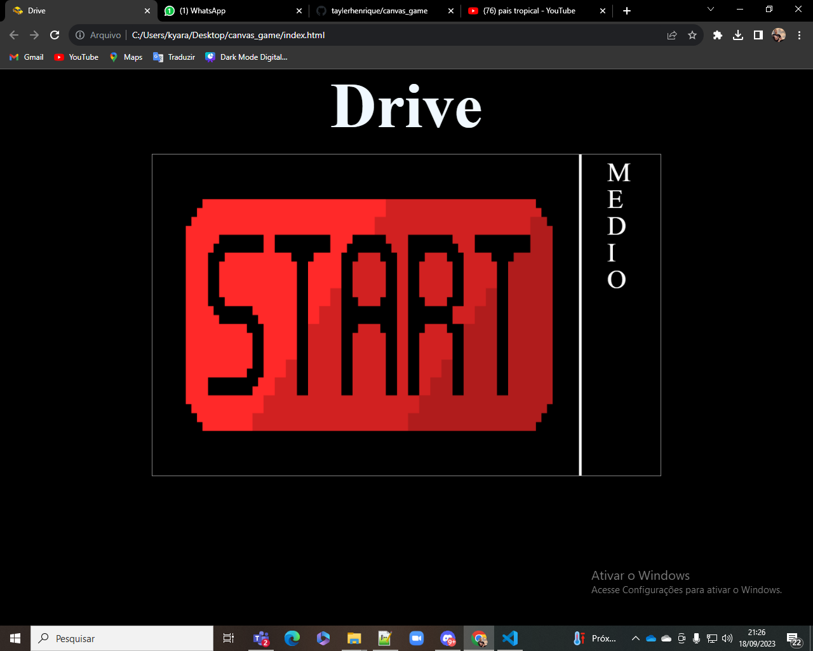
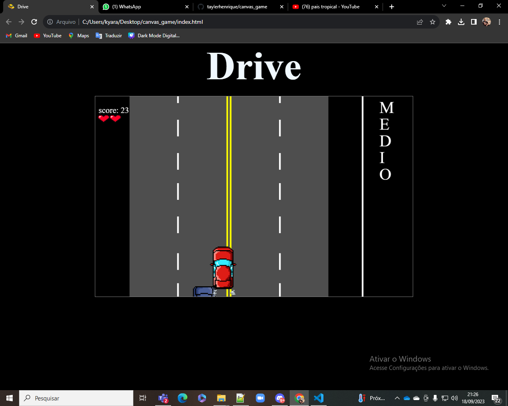

# Jogo No Canvas
<h1>Atividade de DJW - Canvas</h1>

<h2>Autores:</h2> Ruan e Tayler

<h2>Elementos usados:</h2> HTML, Css, JavaScript

<h2>Descrição do projeto:<h2>
Este é um projeto de jogo no canvas, que tem como objetivo, representar de forma ilustrativa a música:

-País tropical https://youtu.be/JzByVhWju88?si=rnok2wdgPkwUgs8h

Ela representa nosso país contando a alegria que temos durante o mês de fevereiro (Durante o carnaval) e mostra a simpatia e felicidade que temos nessa época do ano
O jogo retrata esse temas de forma simplificada e tenta fazer o usuário refletir sobre estes temas ao jogar o jogo.
O Jogo pode mostrar apenas um carro na contra-mão e a cada espaço que ele se move ele ganha pontos. Mais se pensarmos fora do padrão do jogo percebemos que a cada dificuldade e o motorista alcoolizado colocando sua vida em risco cada fez mais.

   
   
   Vídeo funcionando o jogo 
   https://youtu.be/Una284Mpx0M

<h2>Informações do Jogo:<h2> 

      
- [Pressione o botão Start para iniciar o jogo]()
      
- [Pressione a Tecla D para movimentar o veiculo para a Direita]()
  
- [Pressione a Tecla A para movimentar o veiculo para a Esquerda]()
  
- [Desvie dos carros para obter o maior score]()
  
- [Se acaso colidir independente da dificuldade, clicar em Game Over para reiniciar o jogo]()
  

